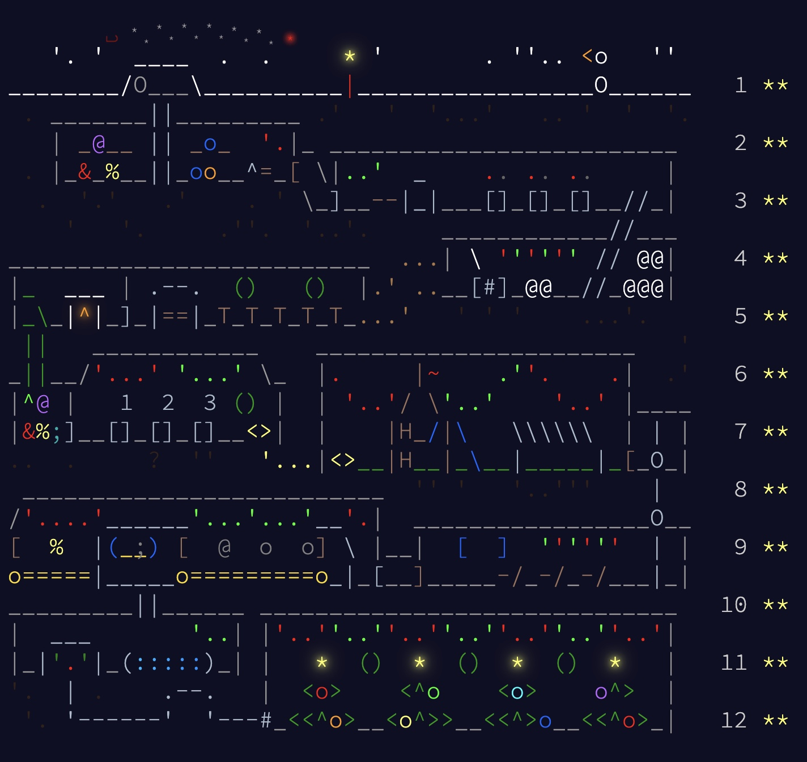

# Advent of Code 2025

These are my solutions to all 24 stars in the 2025 edition of the Advent of Code! These are all in C++ without the use of any external libraries (other than bits/stdc++.h) and with input parsing as is.

I have also commented every file with notes describing the solutions. If you found this helpful, please do consider starring the repo!

You can find my code for previous editions here:
- [Advent of Code 2024](https://github.com/aksharye/advent-of-code-2024/)

